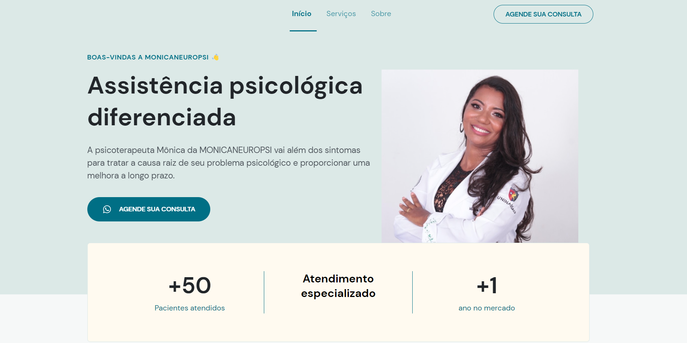

<h1 align="center">
    
</h1>

<h4 align="center"> 
 👩‍⚕️	 Site Concluído!! 	
</h4>

 <a href="#-sobre-o-projeto">Sobre</a> •
 <a href="#-funcionalidades">Funcionalidades</a> •
 <a href="#-layout">Layout</a> • 
 <a href="#-como-executar-o-projeto">Como executar o site</a> • 
 <a href="#-tecnologias">Tecnologias</a> • 
 <a href="#-autor">Autor</a> • 
 <a href="#user-content--licença">Licença</a>

## 💻 Sobre o projeto

👩‍⚕️ O MONICANEUROPSI - é o meu primeiro projeto desenvolvido como um freelance para uma psicoterapeuta com o intuito dela poder alcançar novos clientes, mostrando seus serviços, de maneira pratica e visual

Esse projeto foi inteiro desenvolvido durante o **NLW - Next Level Week Return** oferecida pela [Rocketseat](https://blog.rocketseat.com.br/primeira-next-level-week/), e modificado para com o gosto da minha cliente.

O NLW é uma experiência online com muito conteúdo prático, desafios e hacks onde o conteúdo fica disponível durante uma semana.

---

## ⚙️ Funcionalidades

- [x] clientes podem ver os serviços por ela disponibilizados
- [x] ter acesso a um formulario
- [x] ter acesso para contado via, whatsapp e email
- [x] acesso a localização através do google maps nos locais onde ela costuma atender
- [x] Os usuários tem acesso ao site inteiramente responsivo ou seja podendo acessar por:
- [x] pc/notebooks
- [x] tablets
- [x] celulares

---

## 🎨 Layout

### Mobile

  

  

  

---

### Web

  

  

  

---

## 🚀 Como executar o projeto/site

basta acessar o o link
[Monicaneuropsi](https://deyvisontav.github.io/Psicoterapeuta-Monica-fontes/)

---

## 🛠 Tecnologias

As seguintes ferramentas foram usadas na construção do projeto:

#### **Website**/**Mobile** ([Html](https://devdocs.io/html//) + [Css](https://devdocs.io/css/) + [Js](https://devdocs.io/javascript))

---

## 🦸 Autor

 
<a href="https://github.com/DeyvisonTav">
 
  
  
 <b>Deyvison Tavares</b>🚀</a>
  
  

---

## 📝 Licença

Este projeto esta sobe a licença [MIT](./LICENSE).

Feito com ❤️ por Deyvison Tavares 👋🏽 [Entre em contato!](https://www.linkedin.com/in/deyvison-tavares/)
